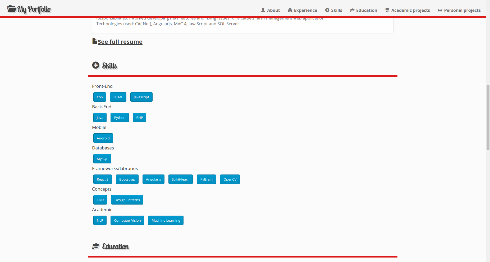

# README #

A simple portfolio to talk about me and show some of my work projects.

### What is this repository for? ###
This repository contains the source code for an online resume/portfolio
web page.

### How do I get set up? ###

* Summary of set up
* Configuration
	You have to set the following environment variables:
		- SECRET_KEY
		- ALLOWED_HOSTS
		- DEBUG
		- STATIC_ROOT

* Dependencies
	- [Django 1.7](https://www.djangoproject.com/)
	- [Djangorestframework](http://www.django-rest-framework.org/)
	- [ReactJs](https://facebook.github.io/react/)
	- [Python3.4.3](https://www.python.org/)

### Who do I talk to? ###
	
	Victor Trejo.
	Email: vic3jo AT gmail DOT com

### Screenshot of the app ###
